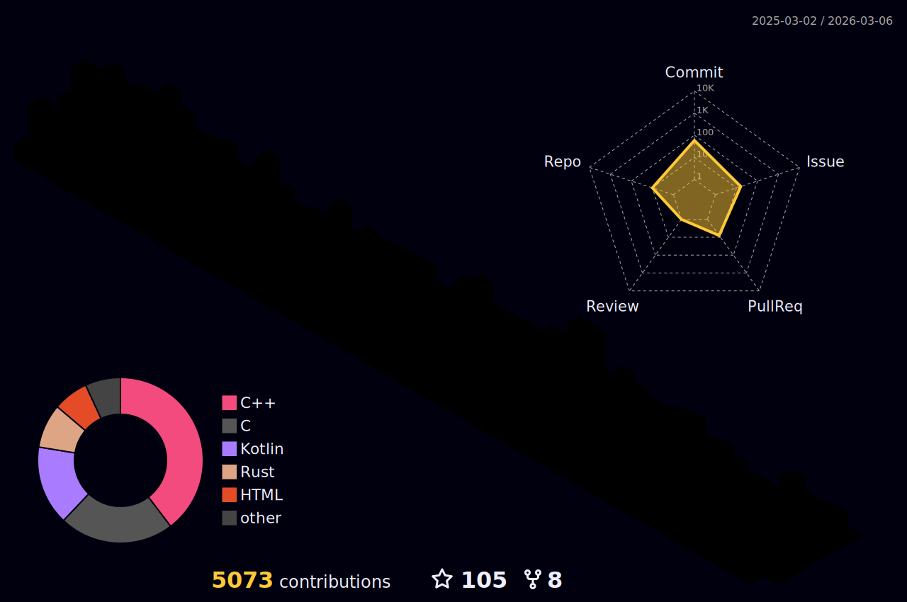

### Hello! 👋🏻

- I'm a self-taught software engineer with 7+ years of experience; mostly working on game related projects.
- I can be reached on [Twitter](https://twitter.com/ifarbod).
- I'm currently working on a game-engine for open-world and first-person shooter games.
- I write my code in **Visual Studio 2022** and/or **Visual Studio Code** on Windows 11.
- My favorite programming languages - in order of preference - are **C++,** **Python**, Kotlin, Rust, Dart, C#, TypeScript and Java.

  

