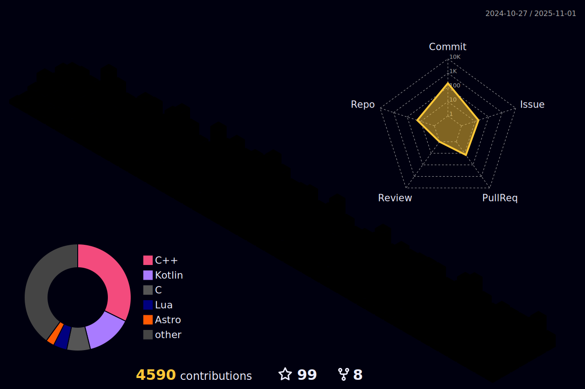

### Hello! 👋🏻

- I'm a self-taught software engineer with 7+ years of experience; mostly working on game related projects.
- I can be reached on [Twitter](https://twitter.com/ifarbod).
- I'm currently working on a game-engine for open-world and first-person shooter games.
- My development environment of choice is Windows 11, where I craft my code using Visual Studio Code.
- My favorite programming languages - in order of preference - are **C++,** **Python**, **Rust**, Dart, Kotlin, C#, TypeScript and Java.

  

